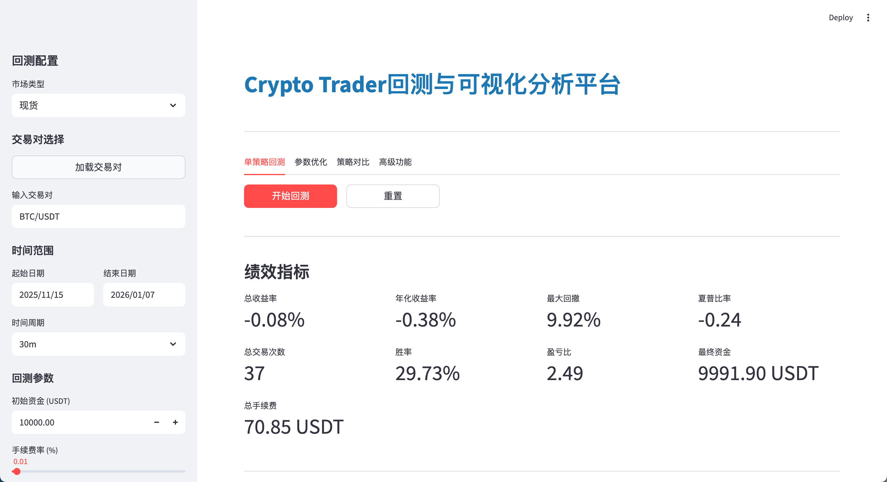
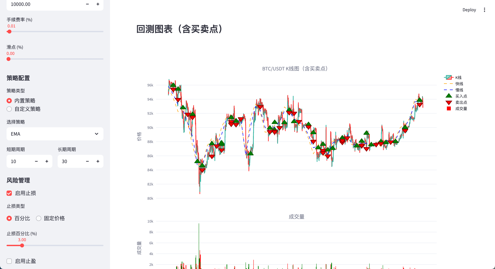
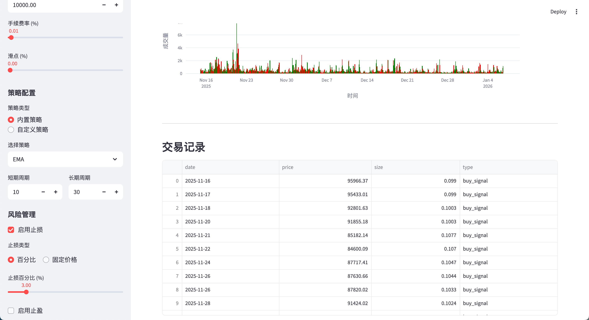

# 数字货币回测与可视化分析平台

基于币安（Binance）API的数字货币回测与可视化分析平台，支持现货/永续合约USDT交易对的多时间框架技术分析，通过Backtrader实现策略回测，并基于Streamlit提供交互式可视化界面。








## 功能特性

### 核心功能（P0）
- ✅ 币安交易对/K线数据获取（异步、代理支持）
- ✅ Backtrader基础回测（初始资金/手续费/滑点配置）
- ✅ Streamlit交互式界面
- ✅ 代理支持（强制使用 http://127.0.0.1:7890）
- ✅ 单策略回测+基础绩效指标
- ✅ 简单交互式图表（Plotly）

### 内置策略
- MA移动平均线交叉策略
- EMA指数移动平均线策略
- RSI超买超卖策略
- MACD金叉死叉策略
- BOLL布林带突破策略

## 技术架构

### 分层设计
- **数据层**：`BinanceDataFetcher` - 异步API请求、代理支持、数据标准化
- **回测配置层**：`BacktraderConfig` - Cerebro初始化、Broker参数配置
- **策略层**：`StrategyTemplate` - 内置策略模板、自定义策略支持
- **回测引擎层**：`BacktraderEngine` - 策略执行、绩效指标计算
- **可视化层**：`StreamlitUI` - 界面渲染、交互式图表
- **系统层**：`ProxyManager`、`ExceptionHandler` - 代理管理、异常处理

### 设计原则
- **分层解耦**：数据/回测/策略/可视化四层完全隔离
- **异步优先**：数据层全异步实现，最大化IO效率
- **无冗余缓存**：K线数据按需拉取，仅缓存静态元数据
- **计算本地化**：向量化操作，拒绝循环遍历
- **资源极简复用**：仅复用HTTP会话、Cerebro核心对象
- **快速失败**：参数校验、异常处理前置

## 安装与使用

### 环境要求
- Python 3.8~3.11
- 操作系统：Windows 10+ / macOS 12+ / Linux (Ubuntu 20.04+)

### 安装步骤

1. **克隆项目**
```bash
git clone <repository-url>
cd backtrader
```

2. **创建虚拟环境**
```bash
python -m venv venv
source venv/bin/activate  # Windows: venv\Scripts\activate
```

3. **安装依赖**
```bash
pip install -r requirements.txt
```

4. **配置代理**（可选）
确保代理服务运行在 `http://127.0.0.1:7890`（代码中已内置默认值）

5. **启动应用**
```bash
streamlit run app.py
```

### 使用流程

1. **选择市场**：在侧边栏选择"现货"或"永续合约"
2. **加载交易对**：点击"🔄 加载交易对"按钮
3. **选择交易对**：从下拉列表中选择目标交易对（如BTC/USDT）
4. **配置时间范围**：选择起始日期、结束日期和时间周期
5. **设置回测参数**：配置初始资金、手续费、滑点等
6. **选择策略**：从内置策略中选择或自定义
7. **开始回测**：点击"🚀 开始回测"按钮
8. **查看结果**：查看绩效指标、K线图表、交易记录

## 项目结构

```
backtrader/
├── app.py                 # Streamlit应用入口
├── requirements.txt       # 依赖包列表
├── README.md             # 项目说明文档
├── readme.md             # 需求文档
├── src/
│   ├── __init__.py
│   ├── data/             # 数据层
│   │   ├── __init__.py
│   │   └── binance_fetcher.py
│   ├── backtest/         # 回测层
│   │   ├── __init__.py
│   │   ├── backtrader_config.py
│   │   └── backtrader_engine.py
│   ├── strategy/         # 策略层
│   │   ├── __init__.py
│   │   └── strategy_templates.py
│   ├── visualization/    # 可视化层
│   │   ├── __init__.py
│   │   └── streamlit_ui.py
│   └── system/           # 系统层
│       ├── __init__.py
│       ├── proxy_manager.py
│       └── exception_handler.py
```

## 配置说明

### 回测参数
- **初始资金**：默认10000 USDT，可自定义
- **手续费率**：百分比费率，默认0.1%
- **滑点**：百分比滑点，默认0%
- **杠杆倍数**：仅合约市场，范围1-125x

### 代理配置
默认使用 `http://127.0.0.1:7890`，如需修改可在代码中调整 `ProxyManager` 的默认值。

## 性能指标

回测完成后自动计算以下绩效指标：
- 总收益率
- 年化收益率
- 最大回撤
- 夏普比率
- 胜率
- 盈亏比
- 总交易次数
- SQN（系统质量指标）

## 注意事项

1. **代理服务**：确保代理服务正常运行，否则无法获取币安数据
2. **网络环境**：需要能够访问币安API（通过代理）
3. **数据准确性**：回测数据来自币安API，请确保网络连接稳定
4. **策略风险**：本平台仅用于回测分析，不提供实盘交易功能

## 开发计划

### P1（重要）
- [x] 多指标集成+参数自定义
- [x] 止盈止损/仓位管理
- [x] 全量绩效指标
- [x] 交易记录展示与导出
- [x] 自定义策略编写
- [ ] 多时间框架分析
- [ ] 移动止盈

### P2（优化）
- [x] 多策略对比
- [x] 参数网格搜索优化
- [x] 高级绩效指标
- [ ] 批量回测
- [ ] 界面个性化配置
- [x] 缓存机制
- [ ] 高级订单类型支持
- [ ] 帮助文档/引导

### P3（未来规划）

#### AI/LLM集成
- [ ] LLM辅助策略生成：使用大语言模型根据用户描述自动生成交易策略代码
- [ ] 智能策略优化：基于LLM分析历史回测结果，自动推荐参数优化方向
- [ ] 自然语言策略编辑：支持用自然语言描述策略逻辑，自动转换为Backtrader代码
- [ ] 策略解释与文档生成：使用LLM自动生成策略说明文档和风险提示

#### 多指标策略增强
- [ ] 多指标组合策略：支持同时使用MA、EMA、RSI、MACD、BOLL等多个指标
- [ ] 复杂条件逻辑：支持AND/OR/NOT等逻辑运算符组合多个指标条件
- [ ] 指标权重配置：为不同指标设置权重，实现加权决策
- [ ] 动态指标选择：根据市场状态自动选择最有效的指标组合
- [ ] 指标冲突处理：当多个指标信号冲突时的智能决策机制

#### 多时间框架策略
- [ ] 多时间框架数据同步：同时获取和分析1m、5m、1h、1d等多个时间框架数据
- [ ] 时间框架策略：在不同时间框架上应用不同策略，实现多层级分析
- [ ] 时间框架信号融合：将多个时间框架的信号进行融合，提高信号可靠性
- [ ] 时间框架切换策略：根据市场波动自动切换主要分析时间框架
- [ ] 跨时间框架回测：支持在多时间框架环境下进行回测验证

#### 高级功能
- [ ] 机器学习策略：集成scikit-learn等库，支持基于机器学习的策略
- [ ] 实时回测：支持实时数据流回测，模拟实盘交易环境
- [ ] 策略回放：支持逐K线回放策略执行过程，便于调试和优化
- [ ] 策略模板市场：用户可分享和下载策略模板
- [ ] 云端回测：支持大规模分布式回测，提高回测效率

## 许可证

MIT License

## 贡献

欢迎提交Issue和Pull Request！
